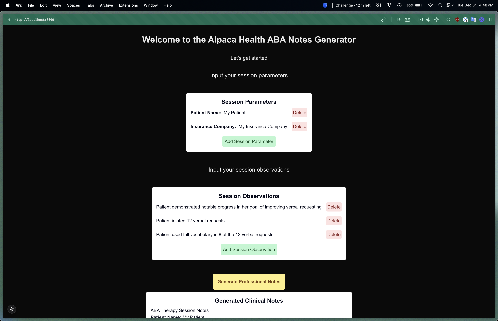
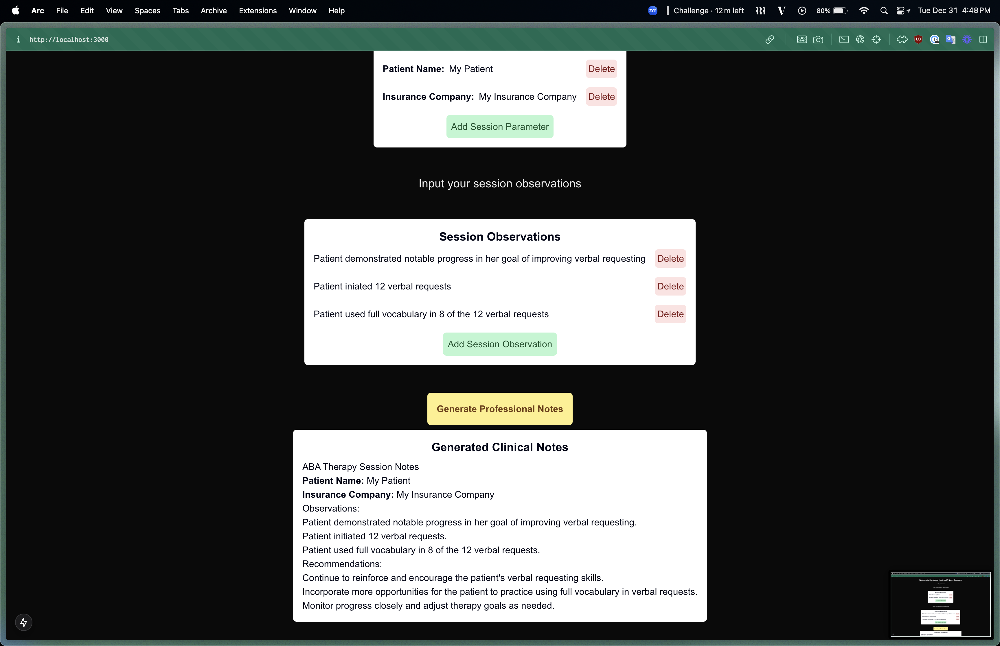

# Alpaca Health Software Engineering Take-Home Project - Sathira

### Project Description

Visit this link for details:
[https://harviio.notion.site/Alpaca-Health-Eng-Take-home-Project-1411bfc50b90803382d4cae01f9bcf18?pvs=4](https://www.notion.so/harviio/ABA-Session-Note-Generator-Take-Home-Project-1411bfc50b90803382d4cae01f9bcf18?pvs=4)

## Approach and challenges

### Challenges

- I am new to many of the elements of the stack of this project including
  - Next JS
  - Fast API
- I have limited time to set up and run this projext

### Approach

1. Set up a basic open ai gpt prompter API endpoint using Fast API
2. Hone in the details of the gpt prompts to be specific to the topic of this project
3. Specify output format for AI prompt
4. Set up a basic frontend with an API folder, some components and state
5. Create product components to interact with the API we created
6. Use a centralized state repository like `Jotai` to avoid complex prop passing between components
7. Tie all the components together into a single page app to avoid spending time figuring out routing
   a. use the `use client` directitve when necessary to avoid spending time figuring out Next.js `SSR`

## Design Decisions

- Single Page app to avoid routing complexities and let the user input data from top to bottom
  - Reason: for the sake of time
- User does not save sessions and instead continually updates the current session
  - Reason: for the sake of time
- User does not edit session details and instead creates and deletes them
  - Reason: for the sake of time
- No tests for now
  - Reason: for the sake of time

## Assumptions

- User thinks of session parameters as key value pairs
- User thinks of session observations as a list of strings they jot down

## Sources

- Sample ABA notes
  - artemisaba.com/blog/aba-session-notes

## Pictures




## Setup Instructions

### Backend Setup (Python 3.11+ required)

Create a `.env` file in the `backend` directory and copy the contents of `backend/.env.example` to the file, replacing the sample values with your desired values

Start the app using the following commands

```bash
# Create and activate virtual environment
python -m venv alpaca_venv
source alpaca_venv/bin/activate  # or `venv\Scripts\activate` on Windows

# Install dependencies
pip install -r requirements.txt

# Start the server
fastapi dev main.py
```

### Frontend Setup (Node.js 18+ required)

Create a `.env` file in the `frontend` directory and copy the contents of `frontend/.env.example` to the file, replacing the sample values with your desired values

Start the app using the following ocmmands

```bash
# Navigate to frontend directory
cd frontend

# Install dependencies
npm install

# Start the development server
npm run dev
```

The application will be available at:

- Frontend: http://localhost:3000
- Backend API: http://localhost:8000
- API Documentation: http://localhost:8000/docs

## Default Project Structure

- `frontend/`: Next.js application
  - `src/components/`: Reusable React components
  - `src/app/`: Next.js app router pages
- `backend/`: FastAPI application
  - `app/main.py`: API endpoints

## Development

- Frontend runs on port 3000 with hot reload enabled
- Backend runs on port 8000 with auto-reload enabled
- API documentation available at http://localhost:8000/docs
